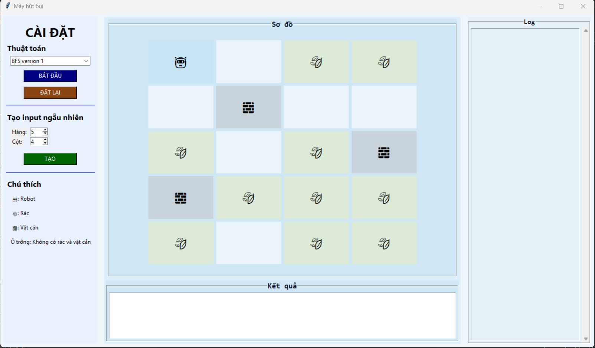

# 🧠 Trí tuệ nhân tạo

## Giới thiệu
Kho lưu trữ mã nguồn, tài liệu và bài tại lớp và tập về nhà hàng tuần cho môn học **Trí tuệ nhân tạo (ARIN330585)**

## Mục tiêu môn học  
Cung cấp kiến thức cơ bản về các phương pháp giải quyết vấn đề bằng tìm kiếm trong không gian trạng thái.  

## Liên quan  
Link project cá nhân: 
* Bài toán máy hút bụi (vacuum cleaner)
* Mỗi thuật toán tìm kiếm được tổ chức thành module
* gui.ipynb import các thuật toán và xây dựng giao diện

[**Click here**](https://github.com/Duc-Luong060106/vacuum_cleaner_personal_project)

---

## 🛠️ Môi trường sử dụng

* **Ngôn ngữ lập trình:** Python 3.13.5
* **IDE:** VS Code 
* **Các thư viện:**
  * `tkinter`: Thư viện giao diện đồ họa tiêu chuẩn được tích hợp sẵn trong ngôn ngữ lập trình Python.
  * Đang tiếp tục cập nhật...

---

## 📂 Cấu trúc
  * **Tuần 2, 3, 4**: Mỗi task được thực hiện trong 1 file notebook riêng. Kết quả thực thi hiển thị trên Cell Output, với đầu vào được cố định trong code.
  * **Từ tuần 4 trở đi**: Nhiệm vụ chung là xây dựng phần GUI với bài toán máy hút bụi, mỗi tuần thêm các thuật toán học được vào. Em đã thực hiện trong 1 file notebook lớn, với các thuật toán là các hàm được viết trong các cell (có markdown đánh dấu thuật toán nào).

---

## ⚙️ Các thuật toán tìm kiếm đã cài đặt

1. **Tìm kiếm mù (Uninformed Search):**
   * **BFS (Breadth-First Search):** Tìm kiếm bằng cách duyệt theo chiều ngang, bao gồm cách tiếp cận 1 và cách tiếp cận 2.
   * **DFS (Depth-First Search):** Tìm kiếm bằng cách duyệt theo chiều sâu, bao gồm cách tiếp cận 1 và cách tiếp cận 2.
   * **IDS (Iterative Deepening Search):** Tìm kiếm theo chiều sâu với giới hạn độ sâu được tăng dần sau mỗi lần lặp, bao gồm cách tiếp cận 1 và cách tiếp cận 2.
   * **UCS (Uniform Cost Search):** Tìm đường đi chi phí $g(n)$ thấp nhất. 

2. **Tìm kiếm có thông tin (Informed Search):**
   * **Greedy Search:** Lựa chọn bước đi tối ưu cục bộ dựa trên hàm Heuristic $h(n)$.
   * **A\* Search:** Tối ưu hóa toàn cục, lựa chọn dựa trên $f(n)$ kết hợp chi phí thực $g(n)$ và ước lượng $h(n)$.
   * **IDA\*:** Là sự kết hợp giữa IDS và A*, tìm kiếm bằng cách duyệt theo từng mức cost và mỗi mức chạy thuật toán A*.
3. **Tìm kiếm cục bộ (Local Search):**
   Tại node đang xét, tìm trong số nút con sinh ra node tốt hơn để di chuyển tiếp.  
   * **Hill Climbing:**
     * **Simple hill climbing:** Sinh các node con lần lượt, nếu gặp node tốt hơn thì dùng node đó xét tiếp.
     * **Steepest Ascent hill climbing:** Chọn node tối ưu nhất trong node con sinh ra để xét tiếp.
     * **Stochastic hill climbing:** Chọn ngẫu nhiên trong các node con hơn cha để xét tiếp.
     * **Random start hill climbing:** Có số lần chạy lại tối đa, mỗi lần chạy thuật toán Leo đồi ngẫu nhiên nếu không tìm được kết quả sẽ khởi tạo lại.    
   
 **Đang tiếp tục được cập nhật ...**

---

## 🗔 Giao diện
**Xây dựng cửa sổ giao diện như hình**

  

 * **Bên trái**: Cài đặt - chọn thuật toán, kích thước ma trận đầu vào, tạo ngẫu nhiên và chạy thuật toán.
 * **Phía trên chính giữa**: Sơ đồ phòng chia thành các ô, robot chuyển động từng bước và hút bụi.
 * **Phía dưới chính giữa**: In ra thời gian chạy thuật toán, số bước di chuyển và chuỗi hành động.
 * **Bên trái**: Log Panel - Ghi lại thông tin từng bước di chuyển.
 
**Khi chạy giao diện**

  

 
---

## 📅 Bảng theo dõi tiến độ công việc hàng tuần

**Kí hiệu viết tắt:**
  * **BTTL**: Bài tập tại lớp.
  * **BTVN**: Bài tập về nhà.

| Buổi | Nhiệm vụ (Task) | Mô tả chi tiết công việc | Link GitHub | Trạng thái |
| :---: | :--- | :--- | :--- | :---: |
| **2** | **BTTL**: Simple reflex agent 01 | Triển khai Simple reflex agent cho bài toán 8-Puzzles | [Session_02_classwork](https://github.com/Duc-Luong060106/TriTueNhanTao/tree/main/bai_tap_1_AI) | ⚠️ Hoàn thành, nhưng chưa đúng với thuật toán |
| **3** | **BTTL**: Simple reflex agent 02 | Triển khai Simple reflex agent cho bài toán Máy hút bụi (Vacuum cleaner) phiên bản **chưa có** vật cản | [Session_03_classwork](https://github.com/Duc-Luong060106/TriTueNhanTao/blob/main/bai_tap_2_AI/hut_bui.ipynb) | ✅ Hoàn thành |
| **3** | **BTVN**: Simple reflex agent 03 | Triển khai Simple reflex agent cho bài toán Máy hút bụi (Vacuum cleaner) phiên bản **đã có** vật cản | [Session_03_homework](https://github.com/Duc-Luong060106/TriTueNhanTao/blob/main/bai_tap_2_AI/hut_bui_ver2.ipynb) | ✅ Hoàn thành |
| **4** | **BTTL**: Model-based reflex agent 01 | Triển khai Model-based reflex agent cho bài toán 8-Puzzles | [Session_04_classwork](https://github.com/Duc-Luong060106/TriTueNhanTao/blob/main/model_based_reflex_agent/8_puzzles_model_based.ipynb) | ✅ Hoàn thành |
| **4** | **BTVN**: Model-based reflex agent 02 & BFS | Triển khai Model-based reflex agent cho bài toán Máy hút bụi (Vacuum cleaner) và thuật toán BFS cho bài toán 8-Puzzles | [Session_04_homework_Model-based](https://github.com/Duc-Luong060106/TriTueNhanTao/blob/main/model_based_reflex_agent/hut_bui_model_based.ipynb) [Session_04_homework_bfs](https://github.com/Duc-Luong060106/TriTueNhanTao/tree/main/bfs)| ✅ Hoàn thành |
| **5** | **BTVN**: BFS & DFS | Cài đặt thuật toán BFS (2 version) và DFS (2 version) cho bài toán máy hút bụi & **giao diện** | [Session_05_homework](https://github.com/Duc-Luong060106/TriTueNhanTao/tree/main/b%C3%A0i_t%E1%BA%ADp_v%E1%BB%81_nh%C3%A0_bu%E1%BB%95i_5) | ✅ Hoàn thành |
| **6** | **BTVN**: IDS & UCS | Bổ sung thuật toán IDS (2 version) và UCS cho bài toán máy hút bụi & **giao diện** đã xây dựng ở tuần 5 | [Session_06_homework](https://github.com/Duc-Luong060106/TriTueNhanTao/tree/main/btvn_bu%E1%BB%95i_6) | ✅ Hoàn thành |
| **7** | **BTVN**: Greedy & A* | Bổ sung thuật toán Greedy Search và A* cho bài toán máy hút bụi & **giao diện** đã xây dựng ở các tuần trước đó | [Session_07_homework](https://github.com/Duc-Luong060106/TriTueNhanTao/blob/main/btvn_bu%E1%BB%95i_7/vacuum_cleaner_gui_greedy_and_astar.ipynb) | ✅ Hoàn thành |
| **8** | **BTVN**: IDA* & Hill Climbing (3 version) | Bổ sung thuật toán IDA* và thuật toán Leo đồi: đơn giản, dốc nhất và ngẫu nhiên cho bài toán máy hút bụi & **giao diện** đã xây dựng ở các tuần trước đó | [Session_08_homework](https://github.com/Duc-Luong060106/TriTueNhanTao/tree/main/homework_session_08) | ✅ Hoàn thành |
| **9** | **BTVN**: Hill Climbing (last version - Khởi tạo ngẫu nhiên) | Bổ sung Thuật toán Leo đồi khởi tạo ngẫu nhiên cho bài toán máy hút bụi & **giao diện** đã xây dựng ở các tuần trước đó | [Session_09_homework](https://github.com/Duc-Luong060106/TriTueNhanTao/tree/main/homework_session_09) | ✅ Hoàn thành |

---

## 👤 Thông tin cá nhân

* **Họ và tên:** Phạm Trần Đức Lương
* **MSSV:** 24110281
* **Môn học:** Trí tuệ nhân tạo (ARIN330585)
* **GitHub Profile:** [@ducluong](https://github.com/Duc-Luong060106)
